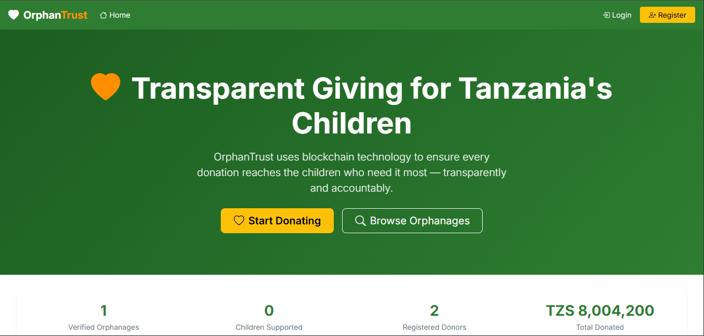
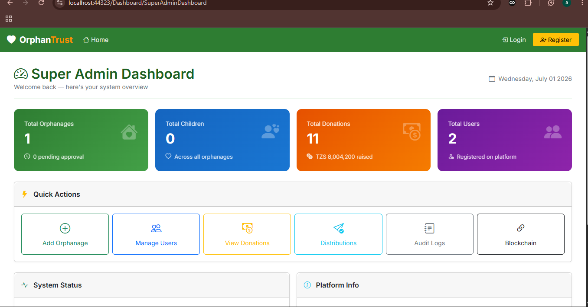
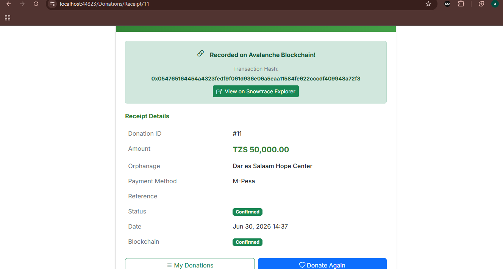
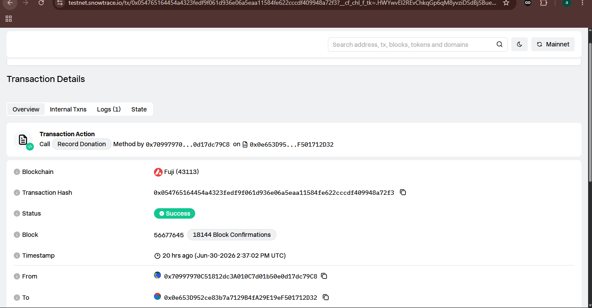

# OrphanTrust 🧡
### Transparent Blockchain-Powered Donation Platform for Tanzania's Orphanages

[](https://dotnet.microsoft.com)
[](https://www.avax.network)
[](https://www.microsoft.com/sql-server)
[](https://getbootstrap.com)
[](https://soliditylang.org)
[](https://testnet.snowtrace.io)

---

## Project Name
**OrphanTrust** — Transparent Giving for Tanzania's Children

## Team Name
**[Your Team Name]**

## Team Members
| Name | Role |
|------|------|
| [Member 1] | Team Lead / Full Stack Developer |
| [Member 2] | Blockchain Developer |
| [Member 3] | Database Architect |
| [Member 4] | UI/UX Designer |

## Track Selected
**DeFi & Blockchain for Social Impact**

---

## Problem Statement

Tanzania has over **400 registered orphanages** housing more than **150,000 children**. Despite billions in annual charitable donations flowing into Africa:

- ❌ Donors have **zero visibility** into how their money is used
- ❌ Most orphanages have **no digital presence**
- ❌ Funds concentrate in a few orphanages while others starve
- ❌ Corruption scandals drive donors away from legitimate causes
- ❌ No accountability layer — distributions happen without evidence

## Why This Matters in Africa

Blockchain is not just technology — **it's trust infrastructure**. Africa receives billions in charity annually yet accountability remains broken. OrphanTrust brings immutable transparency directly to Tanzania's most vulnerable children.

---

## Solution Overview

**OrphanTrust** is a full-stack web platform combining ASP.NET MVC 5 with Avalanche blockchain to create an immutable, transparent, and accountable donation ecosystem for Tanzania's orphanages.

Every donation is recorded on the **Avalanche Fuji Testnet** — creating a permanent, tamper-proof record that anyone can verify on Snowtrace Explorer.

---

## Features

### Super Admin
- Full system dashboard with real-time statistics
- Orphanage verification with **on-chain blockchain recording**
- User management with role-based access control
- View all donations and distributions
- Complete audit log access

### Orphanage Admin
- Orphanage profile management
- Children records management
- Funding needs posting
- View incoming donations

### Donor
- Browse verified orphanages across Tanzania
- Donate to specific orphanages
- **Receive blockchain transaction receipt (TxHash)**
- Real-time donation tracking on Avalanche Fuji
- View transaction on Snowtrace Explorer

### Public Visitor
- Browse all verified orphanages (no login required)
- View orphanage needs and funding progress

---

## Tech Stack

| Layer | Technology |
|-------|-----------|
| Backend Framework | ASP.NET MVC 5 (.NET Framework 4.8) |
| Language | C# |
| ORM | Entity Framework 6 |
| Database | SQL Server 2019+ |
| Frontend | Bootstrap 5, JavaScript, Razor Views |
| Authentication | ASP.NET Identity + Custom RBAC |
| Blockchain | Solidity 0.8+, Avalanche Fuji Testnet |
| Web3 Bridge | Nethereum 4.x |
| Smart Contracts | DonationRegistry, DistributionLedger, OrphanageVerify |

---

## Smart Contract Addresses (Avalanche Fuji Testnet)

| Contract | Address | Explorer |
|---------|---------|---------|
| DonationRegistry.sol | `0x0e653D952ce83b7a7129B4fA29E19eF501712D32` | [View](https://testnet.snowtrace.io/address/0x0e653D952ce83b7a7129B4fA29E19eF501712D32) |
| DistributionLedger.sol | `0xDD57e6CCfBfe3AA1A0EeE7d51A164f66aBA52C1E` | [View](https://testnet.snowtrace.io/address/0xDD57e6CCfBfe3AA1A0EeE7d51A164f66aBA52C1E) |
| OrphanageVerify.sol | `0xec35F05c3C3667624335e3194A50D68f13aF036a` | [View](https://testnet.snowtrace.io/address/0xec35F05c3C3667624335e3194A50D68f13aF036a) |

**Network:** Avalanche Fuji Testnet
**Chain ID:** 43113
**RPC URL:** `https://avalanche-fuji-c-chain-rpc.publicnode.com`
**Explorer:** https://testnet.snowtrace.io

### Sample Live Transaction
- **TX Hash:** `0x854fdec3537b081aa47f77f0a7cc51b585222142706194cf75677dc6e1bd2648`
- **Status:** ✅ Success
- **View:** [Snowtrace Explorer](https://testnet.snowtrace.io/tx/0x854fdec3537b081aa47f77f0a7cc51b585222142706194cf75677dc6e1bd2648)

---

## How Avalanche Blockchain is Used

OrphanTrust uses Avalanche Fuji Testnet as an **immutable trust layer**:

### 1. DonationRegistry Contract
Every confirmed donation writes a transaction to this contract. The TxHash is stored in SQL Server and displayed to the donor as their blockchain receipt.
```solidity
function recordDonation(
    uint256 _donationId, address _donor,
    uint256 _orphanageId, uint256 _amount,
    string memory _currency, string memory _paymentReference
) public returns (bool)
```

### 2. OrphanageVerify Contract
When Super Admin verifies an orphanage, the credentials are written on-chain. Donors can verify any orphanage's legitimacy on Snowtrace.
```solidity
function verifyOrphanage(
    uint256 _orphanageId, string memory _name,
    string memory _registrationNumber, string memory _region
) public returns (bool)
```

### 3. DistributionLedger Contract
Every fund distribution is recorded with evidence hash on-chain — proving money reached the orphanage.
```solidity
function recordDistribution(
    uint256 _distributionId, uint256 _donationId,
    uint256 _orphanageId, uint256 _amount,
    string memory _purpose, string memory _evidenceHash
) public returns (bool)
```

### Nethereum C# Integration
```csharp
var account = new Account(privateKey, 43113);
var web3 = new Web3(account, rpcUrl);
var contract = web3.Eth.GetContract(abi, contractAddress);
var function = contract.GetFunction("recordDonation");
var txHash = await function.SendTransactionAsync(...);
```

---

## How to Run Locally

### Prerequisites
- Visual Studio 2022
- .NET Framework 4.8
- SQL Server 2019+ with SSMS
- Git

### Step 1 — Clone
```bash
git clone https://github.com/abubakarimgomi-123/OrphanTrust.git
cd OrphanTrust
```

### Step 2 — Open Solution
```
Open OrphanTrust.sln in Visual Studio 2022
```

### Step 3 — Install NuGet Packages
```powershell
Install-Package EntityFramework -Version 6.4.4
Install-Package Microsoft.AspNet.Identity.EntityFramework -Version 2.2.3
Install-Package Microsoft.AspNet.Identity.Owin -Version 2.2.3
Install-Package Microsoft.Owin.Host.SystemWeb -Version 4.2.2
Install-Package BCrypt.Net-Next -Version 4.0.3
Install-Package Nethereum.Web3 -Version 4.14.0
Install-Package Nethereum.Contracts -Version 4.14.0
Install-Package Newtonsoft.Json -Version 13.0.3
```

### Step 4 — Configure Database
`Web.config` connection string (already configured):
```xml
<add name="OrphanTrustContext"
     connectionString="Data Source=.;Initial Catalog=OrphanTrustDB;
     Integrated Security=True;MultipleActiveResultSets=True;
     TrustServerCertificate=True"
     providerName="System.Data.SqlClient" />
```

### Step 5 — Run Migrations
```powershell
Enable-Migrations
Add-Migration InitialCreate
Update-Database
```

### Step 6 — Run the Application
```
Press F5 in Visual Studio
```

### Step 7 — Login as Super Admin
```
URL:      http://localhost:44323/Account/Login
Email:    superadmin@orphantrust.tz
Password: Admin@OrphanTrust2024!
```

### Step 8 — Demo Flow
1. Login as Super Admin → view dashboard
2. Go to Orphanages → Add orphanage → Click verify (records on blockchain)
3. Register as Donor → Browse orphanages → Make donation
4. See receipt with TX hash → Click "View on Snowtrace Explorer"
5. View live transaction on Avalanche Fuji blockchain

---

## Project Structure

```
OrphanTrust/
├── App_Start/
│   ├── IdentityConfig.cs        # ASP.NET Identity managers
│   ├── BundleConfig.cs          # CSS/JS bundles
│   └── RouteConfig.cs           # URL routing
├── Controllers/
│   ├── AccountController.cs     # Auth: login, register
│   ├── DashboardController.cs   # Role-based dashboards
│   ├── OrphanagesController.cs  # Orphanage management
│   ├── DonationsController.cs   # Donation + blockchain
│   ├── UsersController.cs       # User management
│   ├── DistributionsController.cs
│   └── AuditLogsController.cs
├── Infrastructure/
│   ├── Blockchain/
│   │   └── BlockchainService.cs # Nethereum integration
│   ├── Constants/
│   │   └── RoleConstants.cs     # RBAC roles
│   └── Seed/
│       └── DatabaseSeeder.cs    # Initial data
├── Models/
│   ├── ApplicationDbContext.cs  # EF6 DbContext
│   └── DomainModels/            # Entity models
├── Views/
│   ├── Account/                 # Login, Register
│   ├── Dashboard/               # Role dashboards
│   ├── Orphanages/              # Orphanage CRUD
│   ├── Donations/               # Donation forms
│   └── Shared/                  # Layout + Sidebar
├── Migrations/                  # EF migrations
└── Web.config                   # Configuration
```

---

## Screenshots

### Landing Page


### Super Admin Dashboard


### Orphanage Management
.png)

### Make a Donation


### Blockchain Receipt


### Snowtrace Explorer - Live Transaction


---

## Demo

> **Live Demo:** http://localhost:44323 (run locally)
> **GitHub:** https://github.com/abubakarimgomi-123/OrphanTrust
> **Demo Video:** [YouTube Link]

---

## Future Improvements

- **Mobile App** — Android application for orphanage admins
- **Swahili Language** — Full Swahili localization
- **M-Pesa Integration** — Direct mobile money payments
- **Mainnet Deployment** — Move to Avalanche mainnet
- **AI-Powered Matching** — Match donors with orphanages
- **SMS Notifications** — For low-connectivity areas
- **NFT Certificates** — Donor impact certificates as NFTs
- **Multi-Country** — Expand to Kenya, Uganda, Rwanda

---

## License
MIT License

---

<div align="center">

Built with ❤️ for Tanzania's children

**OrphanTrust** — Every child deserves a verified future.

*Powered by Avalanche Blockchain*

</div>
